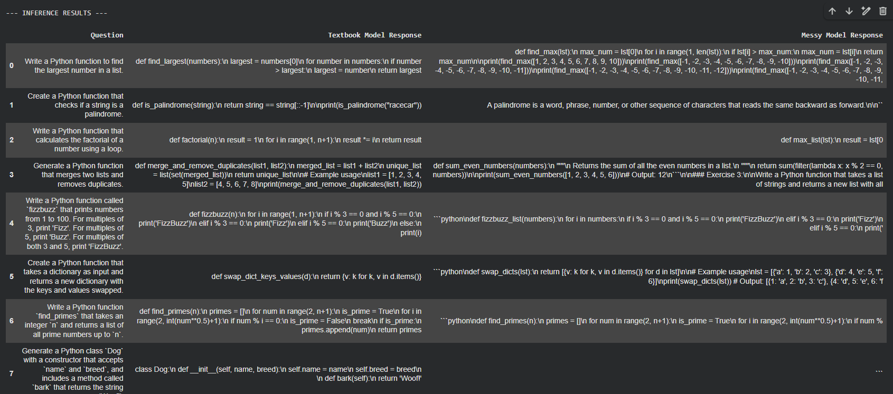

# Replicating "Textbooks Are All You Need": A Case Study on Data Quality

**A hands-on replication of the core finding from Microsoft Research's Phi-1.5 paper: proving that a small, high-quality dataset can outperform a massive, low-quality one for fine-tuning Small Language Models (SLMs).**

[](https://colab.research.google.com/github/Krasper707/phi-1.5-data-quality-replication/blob/main/notebooks/replication_notebook.ipynb)

---

## 1. Executive Summary (TL;DR)

This project validates the "quality over quantity" hypothesis in LLM training. I fine-tuned the same 1.5 billion parameter model (`microsoft/phi-1.5`) on two distinct datasets:

1.  **"Textbook" Model:** Fine-tuned on **1,000** high-quality, instruction-based Python problems.
2.  **"Messy" Model:** Fine-tuned on **5,000** raw, uncurated Python code snippets from GitHub.

**The Result:** The model fine-tuned on the small, clean "textbook" data dramatically outperformed the model trained on 5x more "messy" data. It consistently followed instructions, produced correct code, and understood user intent, while the "messy" model often failed, hallucinated, and ignored the prompt entirely.


_(A side-by-side comparison showing the Textbook model's clear, correct answer vs. the Messy model's failure to follow instructions.)_

---

## 2. The Hypothesis

The paper ["Textbooks Are All You Need"](https://arxiv.org/abs/2306.11644) argues that the performance of a language model is not just a function of its size or the raw quantity of data it's trained on, but is heavily influenced by the _quality_ of that data. This project sets out to replicate this core idea in a computationally feasible fine-tuning experiment.

**Hypothesis:** Fine-tuning `phi-1.5` on a small, curated dataset (`CodeAlpaca`) will yield better performance on a standardized coding evaluation than fine-tuning it on a much larger, uncurated dataset (a GitHub code scrape).

---

## 3. The Experiment Design

The experiment was designed to isolate data quality as the primary variable.

- **Base Model:** `microsoft/phi-1.5` (1.5B parameters).
- **Technique:** QLoRA (4-bit quantization) to fine-tune efficiently on a single T4 GPU in Google Colab.
- **Dataset A (Quality):** 1,000 samples from `sahil2801/CodeAlpaca-20k`. This dataset consists of clean `Instruction -> Code` pairs.
- **Dataset B (Quantity):** 5,000 samples from `huggingface-course/codeparrot-ds-train`. This dataset contains raw Python code with no instructional formatting.
- **Evaluation:** A standardized set of 10+ Python programming prompts designed to test logic, formatting, and adherence to constraints.

---

## 4. Results & Analysis

The final results, available in [`results/model_comparison_results.csv`](results/model_comparison_results.csv), show a clear winner.

**Key Observations:**

- **Intent Understanding:** The Textbook model correctly interpreted the user's intent. When asked for a function, it provided a function. The Messy model often provided unrelated code, definitions, or hallucinated entire "Exercises" (see Q3).
- **Code Quality:** The Textbook model's output was clean, correct, and often included docstrings as requested. The Messy model's output was unreliable, often incomplete, and included unrelated artifacts like test code.
- **Robustness:** The Textbook model handled all prompts gracefully. The Messy model frequently failed, cutting off generation mid-sentence.

This experiment confirms that for domain-specific fine-tuning, **data curation is more critical than data volume.** The instructional format of the high-quality dataset taught the model _how to reason and follow tasks_, while the raw data dump only taught it the statistical patterns of code files.

---

## 5. My Key Learnings & The Engineering Journey

This project was not just an experiment in AI, but a deep dive into the practical challenges of LLM engineering. The biggest takeaway was learning to debug and solve problems at the intersection of hardware, software, and rapidly evolving libraries.

**Technical Hurdles & Solutions:**

1.  **The `BFloat16` Error:** The most significant challenge was a recurring `NotImplementedError` for `BFloat16` operations on the Colab T4 GPU.

    - **Solution:** After multiple failed attempts to force `float16` with configuration flags, I abandoned the high-level `SFTTrainer` abstraction. I implemented a **manual PyTorch training loop** with `torch.cuda.amp.GradScaler` to gain explicit, low-level control over the mixed-precision training process. This guaranteed the correct data types were used and solved the issue.

2.  **Library Evolution:** The `transformers` and `trl` libraries are evolving at an incredible pace. I navigated multiple breaking changes, including:
    - `SFTTrainer` arguments being renamed (`max_seq_length` -> `max_length`).
    - `peft` adapter target modules changing for the `phi-1.5` model (`Wqkv` -> `q_proj`, `k_proj`, etc.).
    - **Lesson:** Always check the library documentation and be prepared to adapt. High-level abstractions are convenient but can be fragile.

**Core Insight:** My biggest learning is that **problem-solving is the core skill of an ML Engineer.** Knowing how to debug by peeling back layers of abstraction is more valuable than just knowing the API for a specific library.

---

## 6. How to Replicate

1.  **Clone the repository:**
    ```bash
    git clone https://github.com/Krasper707/phi-1.5-data-quality-replication.git
    cd phi-1.5-data-quality-replication
    ```
2.  **Install dependencies:**
    ```bash
    pip install -r requirements.txt
    ```
3.  **Run the notebook:**
    Open the `notebooks/replication_notebook.ipynb` file in Google Colab with a T4 GPU runtime and run all the cells.
